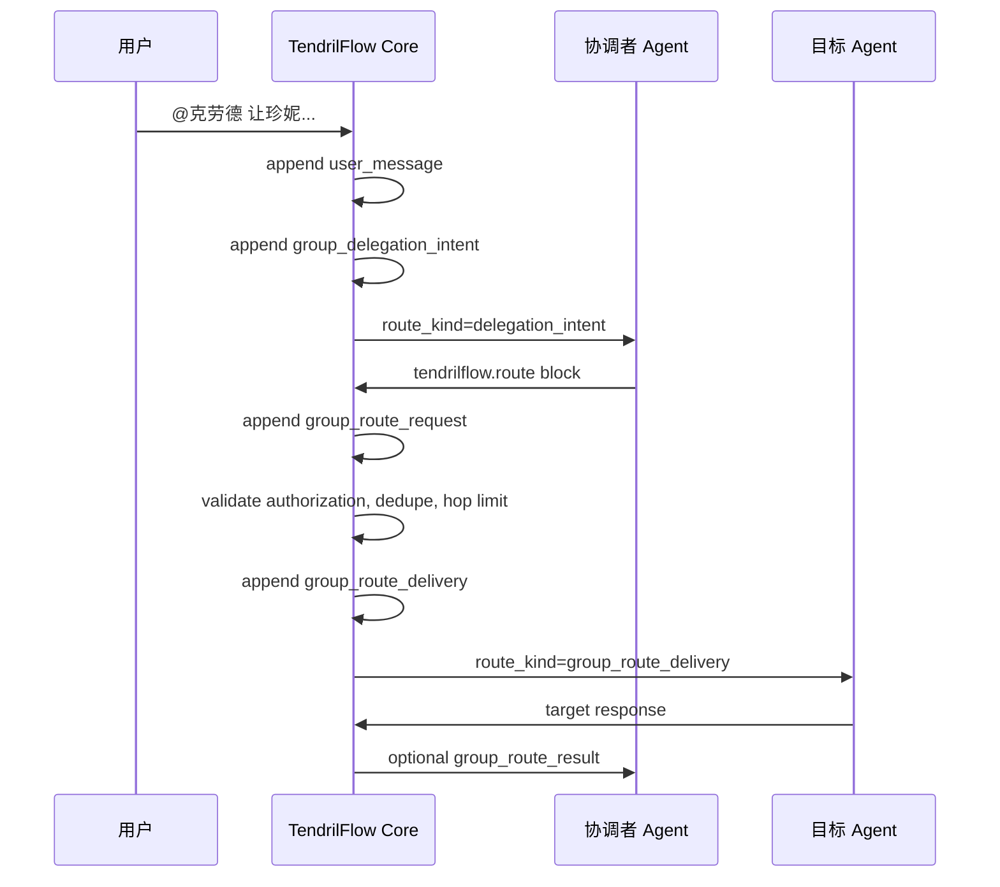

# 群聊 Agent 间委派路由实现

本文档记录 TendrilFlow V1 群聊 agent-to-agent 委派路由的设计与实现。目标是让用户可以在群聊里要求一个 agent 协调另一个 agent，同时保证路由可审计、可控、不会因为普通 `@` 提及而误触发。

## 1. 目标

V1 支持以下协作形态：

- 用户在无任务或有任务的群聊中发起委派，例如：`@克劳德 让珍妮汇报当前 provider、模型和运行方式`。
- TendrilFlow Core 先把用户请求只投递给被点名的协调者 agent。
- 协调者 agent 如果确实需要另一个 agent 响应，必须输出结构化 route block。
- Core 校验该 route 是否来自用户授权的协调链路，再投递给目标 agent。
- 所有关键动作写入 transcript，便于 UI 展示、复盘和调试。

非目标：

- 不把 agent 输出里的普通 `@某人` 自动解释为路由。
- 不支持 agent 私下绕过 Core 直接互相发送隐藏消息。
- 不在 V1 中实现任意多跳自主调度网络。

## 2. 用户入口

当前支持两类用户表达：

```text
@克劳德 让珍妮给你汇报一下它当前使用的 provider、模型和运行方式
```

```text
@克劳德 -> @珍妮: 请汇报当前 provider、模型和运行方式
```

解析结果会形成一个 `group_delegation_intent` 事件。这个事件表示：

- `coordinator`: 用户授权先处理请求的 agent。
- `target`: 用户期望被协调者联系的 agent。
- `instruction`: 给协调者的具体意图。

Core 只会先投递给 `coordinator`，不会直接投递给 `target`。这样可以保留“克劳德先理解、再决定如何请求珍妮”的协作语义。

## 3. Agent 路由协议

被授权的协调者如果需要转交，需要在回复中输出一个 fenced block：

````markdown
```tendrilflow.route
{"to":"珍妮","message":"请汇报当前 provider、模型和运行方式。","reason":"用户要求我协调你提供这些运行信息。","expect_response":true}
```
````

字段说明：

- `to`: 目标 agent 名称或 id。
- `message`: 投递给目标 agent 的具体请求。
- `reason`: 为什么需要这次路由，写给 transcript 和协调者复盘使用。
- `expect_response`: 是否期待目标 agent 回复后回传给协调者。

约束：

- 只有结构化 `tendrilflow.route` block 会触发路由。
- 普通自然语言里的 `@珍妮` 只是可见文本，不会触发投递。
- Core 会校验该 route 是否匹配最近的用户委派授权。
- 重复 route 会被去重。
- V1 设置最大跳数，避免 agent 之间循环转发。

## 4. Transcript 事件流

一次成功的委派大致写入以下事件：



主要事件类型：

- `group_delegation_intent`: 用户授权某个协调者联系目标 agent。
- `group_route_request`: 协调者输出了结构化 route 请求。
- `group_route_delivery`: Core 已将 route 投递给目标 agent。
- `group_route_blocked`: route 被拒绝，例如未授权、目标不存在、重复、超过跳数。
- `group_route_result`: 目标 agent 有可用回复后，Core 可把结果摘要回传给协调者。

## 5. 初始化提示词约定

所有 provider 的 agent init prompt 都需要包含群聊路由规则。核心要求是：

- Agent Room transcript 是共享事实源。
- 如果用户让当前 agent 协调另一个 agent，只能用 `tendrilflow.route` block 请求 Core 转交。
- 不要把普通 `@` 当作路由动作。
- 不要创建隐藏侧聊。
- 不要暴露 private chain-of-thought，只给出简洁依据、证据和结果。

这部分由 `buildAgentInitializationPrompt()` 生成，并通过 `tendrilflow.agent_init.v1` 注入 provider session。已初始化但缺少 `tendrilflow.route` 协议的 agent 会在后台启动时刷新初始化上下文。

## 6. 主要实现位置

核心实现集中在：

- `src/orchestrator.js`
  - 用户委派解析：`resolveGroupDelegationIntents()`、`resolveArrowGroupDelegation()`
  - agent 引用解析：`resolveAgentReference()`
  - route block 提取与解析：`collectGroupRouteBlocks()`、`parseGroupRouteBlock()`
  - agent 输出处理：`handleGroupAgentEvent()`
  - route 校验与投递：`processGroupRouteRequest()`、`blockGroupRoute()`
  - 结果回传：`maybeNotifyGroupRouteResult()`
  - 群聊上下文构造：`buildGroupContextMessage()`
- `scripts/provider-agent.js`
  - provider 后台 adapter 入口。
  - Gemini CLI Windows 参数传递做了特殊处理，避免 `--prompt` 和 positional prompt 冲突。
- `tests/orchestrator.test.js`
  - 覆盖授权委派、结构化 route、重复 route、未授权 route、普通 `@` 不触发、arrow 语法等场景。

## 7. 安全与可靠性

V1 采用保守策略：

- 用户授权优先：agent 不能凭空指挥别的 agent。
- 结构化协议优先：只有机器可解析 block 会触发系统动作。
- transcript 优先：每次路由、投递、阻塞都落盘。
- 去重：同一协调者、目标、消息、授权范围内的重复 route 会被阻止。
- 限制跳数：防止 agent 之间形成无限循环。
- 生命周期日志过滤：例如 `starting gemini headless turn` 这类 provider adapter 生命周期消息不会被当成目标 agent 的真实业务回复。

## 8. 已验证内容

自动化验证：

```bash
npm test
```

当前测试覆盖 75 个用例，其中包含群聊 agent 间委派路由相关场景。

手工验证：

- 在浏览器打开 `http://127.0.0.1:4317/`。
- 启动 `克劳德` 和 `珍妮`。
- 在群聊中发送：`@克劳德 请你指挥珍妮汇报当前 provider、模型和运行方式，然后等她回复后总结给我。`
- transcript 中应出现 `group_delegation_intent`、`group_route_request`、`group_route_delivery`。

## 9. 已知限制

- Gemini CLI 在 Windows 隐藏后台执行时可能触发 `AttachConsole failed`，这是 Gemini CLI/node-pty 在 headless 后台环境下的问题，不是 Core 路由失败。
- V1 route 授权只处理用户明确发起的短链路委派，不做复杂多 agent 自主计划网络。
- `group_route_result` 当前以目标 agent 可见回复为基础，后续可以增强为更结构化的回执事件。
- UI 还可以进一步把 route request、delivery、blocked、result 渲染成更清晰的协作卡片。

## 10. 后续演进

建议的后续方向：

- 为 provider adapter 增加统一的 headless capability 描述，区分 interactive CLI、headless exec、ACP/native API。
- 增加“重新同步初始化上下文”按钮，用于升级 agent init profile。
- 在 UI 中展示完整的委派链路，包括授权来源、协调者、目标、状态和失败原因。
- 引入更细的权限模型，例如允许 Host Agent 对某些 agent 拥有默认协调权限。
- 将动态任务上下文和稳定初始化上下文继续分层，避免 provider session 被过期信息污染。
